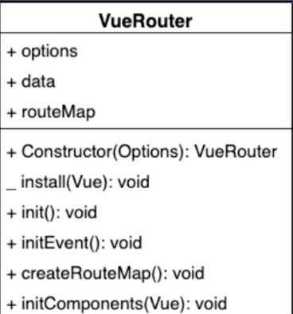

# Vue 源码之手写Vue Router

**源码地址:**<https://github.com/CONOR007/Handwritten-routing>

## Vue Router的两种模式

### hash实现模式原理

- URl中#后的内容作为路径地址
- 监听`hashchange`事件
- 根据当前路由地址找到对应的组件重新渲染

### History实现模式原理

- 通过`history.pushState()`方法改变地址栏
- 监听`popstate`事件
- 根据当前路由地址找到对应组件重新渲染

## Vue Router的使用

vue作为一个渐进式框架取决于它有强大的插件机制,通过注册对应的插件得到想要的功能.

Vue.use可以接受一个**对象类**,调用类中的静态方法`install`实现功能. 也可以接受一个**函数**并直接调用.

```js
import Vue from 'vue'
import VueRouter from 'vue-router'
// 1. 注册路由插件
Vue.use(VueRouter)

// 2. 创建 router 对象
const router = new VueRouter({
  routes
})

new Vue({
  // 3. 注册 router 对象
  router,
  render: h => h(App)
}).$mount('#app')
```

## 类图

根据类图中提供的属性和方法去实现对应的功能,能让我们的目标更加清晰.



如上可见,这个名为**VueRouter**的类它有三个属性和六个方法.其中+号是对外公开的代码,_号是静态方法.

**三个属性:**

`options`属性是记录构造函数传入的对象,比如记录我们在new VueRouter的时候传入的routes对象规则;

`routeMap`是一个对象用来记录路由地址和组件的对应关系,将来我们会将options对应到routeMap中来.

`data`是通过vue.obsverber存储响应式数据的,因为路由地址更改过户对应的组件要更新. 它里边有一个属性current是用来记录当前路由地址的

**六个方法:**

`install`是一个静态方法,用来实现vue的插件机制;

`Constructor`构造函数是用来帮我们初始化对应的属性和方法;

`init`和`initEvent`是用来注册popState事件监听浏览器历史的变化;

`createRouteMap`是用来初始化routeMap属性的把传入的路由规则转换成键值对的形式存储到routeMap中去,键是路由的地址,值是路由的组件;

`initComponents`是用来创建<route-link>和<route-view>这两个组件的.

## 具体实现

**这里我们主要实现历史模式**

### `install`方法实现

`install`当`Vue.use(VueRouter)`时会被调用,它是一个静态方法,用来实现vue的插件机制,它接收一个Vue对象.通过Vue对象的`mixin`能在第一次实例化的时候拿到router.并实现路由方法的初始化.

```js
let _Vue = null
export default class VueRouter {
  static install (Vue) {
    // 1.判断当前插件是否已经被安装
    if (VueRouter.install.installed) return
    VueRouter.install.installed = true
    // 2.把Vue构造函数记录到全局变量
    _Vue = Vue
    // 3.把创建Vue实例时传入的router注入到_Vue上. 混入
    _Vue.mixin({
      beforeCreate () {
        if (this.$options.router) {
          // 创建的时候vue肯定是可以拿到router的 这个时候把它给_Vue的原型
          _Vue.prototype.$router = this.$options.router
          this.$options.router.init()
        }
      }
    })
  }

  init () {
		//初始化方法
  }
}

```

注意`this.$options`拿到的是Vue初始化时传入的对象.所以接下来我们在该类中实现的所有属性和方法都能在this.$options.router中拿到.

```js
const vm = new Vue({
     router,
     render: h => h(App)
 }).$mount('#app')
```

### `constructor`的实现

如下是截取路由规则与实例化代码部分代码

```js
// 路由规则
const routes = [
  {
    path: '/',
    name: 'Index',
    component: Index
  },
  {
    path: '/blog',
    name: 'Blog',
    component: () => import(/* webpackChunkName: "blog" */ '../views/Blog.vue')
  },
  {
    path: '/photo',
    name: 'Photo',
    component: () => import(/* webpackChunkName: "photo" */ '../views/Photo.vue')
  }
]
const router = new VueRouter({
  mode: 'history',
  routes
})
```

`constructor`接收实例化路由对象时传进来的对象,它的作用是初始化属性.

`options`参数就是new VueRouter时传入的对象 `{ mode: 'history', routes}`,其中`routeMap`是一个对象用来记录路由地址和组件的对应关系.

```js
  constructor (options) {
    this.options = options
    this.routeMap = {}
    // observable实现current的双向绑定
    this.data = _Vue.observable({
      current: '/'
    })
  }
```

### `createRouteMap`的实现

`createRouteMap`遍历路由规则,解析成键值对存储在`routeMap`中.键是路由的地址,值是路由的组件.

```js
  createRouteMap () {
    this.options.routes.forEach(element => {
      this.routeMap[element.path] = element.component
    })
  }
```

`initComponents`的实现

`initComponents`主要创建路由中所用到的`<route-link>`和`<route-view>`这两个组件.使用`.component`创建组件,`render`渲染组件,`h`函数创建目标元素或生成虚拟DOM.`clickHandler`用来实现路由的跳转,在历史模式中主要用到HTML5的`history.pushState`API ,作用是改变地址不会向服务端发起请求.

```js
  initComponents (Vue) {
    Vue.component('router-link', {
      props: {
        to: String
      },
      // template: '<a :href="to"><slot></slot></a>'
      render (h) {
        // h函数(生成的目标元素,目标元素属性,内容部分插槽)
        return h('a',{
          attrs : {
            href : this.to
          },
          on : {
            click:this.clickHandler
          },
        },[this.$slots.default])
      },
      methods: {
        clickHandler (e) {
          history.pushState({},'',this.to)
          this.$router.data.current = this.to
          //组织a标签的默认事件
          e.preventDefault();
        }
      },
    })
    
    const self = this
    Vue.component('router-view', {
      render(h) {
        // component 当前路由地址
        const component = self.routeMap[self.data.current]
        // h可以帮我们创建虚拟DOM
        return h(component)
      },
    })
  }
```

这里要注意:完整版本的Vue支持template编译 运行时不支持template如果要使用需要在vue.config.js中配置 runtimeCompiler 或者配置render函数

### `initEvent`实现

`initEvent `用来注册popState事件监听浏览器历史的变化,也就是点击浏览器左上角回退时要更新组件

```js
  initEvent () {
    window.addEventListener('popstate',()=>{
      this.data.current = window.location.pathname
    })
  }
```

### `init`初始化方法

```js
  init () {
    this.createRouteMap()
    this.initComponents(_Vue)
    this.initEvent()
  }
```

## 完整代码

```js
let _Vue = null
export default class VueRouter {
  // install是一个静态方法,用来实现vue的插件机制
  static install (Vue) {
    // 1.判断当前插件是否已经被安装
    if (VueRouter.install.installed) {
      return
    }
    VueRouter.install.installed = true
    // 2.把Vue构造函数记录到全局变量
    _Vue = Vue
    // 3.把创建Vue实例时传入的router注入到_Vue上. 混入
    _Vue.mixin({
      beforeCreate () {
        // 只需要在实例化的时候执行
        if (this.$options.router) {
          // const vm = new Vue({
          //     注册 router 对象
          //     router,
          //     render: h => h(App)
          // }).$mount('#app')
          // 实例化的时候 new Vue中的对象都放在$options中去了. 所以该类中所有属性方法都能在this.$options.router中拿到.          
          _Vue.prototype.$router = this.$options.router
          this.$options.router.init()
        }
      }
    })
  }

  // 构造函数初始化 属性值
  constructor (options) {
    // options是实例化路由对象时传进来的对象
    // {
    //     mode: 'history',
    //     routes
    // }    
    // 是记录构造函数传入的对象,比如记录我们在new VueRouter的时候传入的routes对象规则;
    this.options = options
    // 是一个对象用来记录路由地址和组件的对应关系,将来我们会将options对应到routeMap中来
    this.routeMap = {}
    // 通过vue.obsverber存储响应式数据的,因为路由地址更改过户对应的组件要更新. 它里边有一个属性current是用来记录当前路由地址的
    this.data = _Vue.observable({
      current: '/'
    })
  }

  init () {
    this.createRouteMap()
    this.initComponents(_Vue)
    this.initEvent()
  }

  // 遍历路由规则,解析成键值对存储在routeMap中
  createRouteMap () {
    this.options.routes.forEach(element => {
      // 键是路由的地址,值是路由的组件
      this.routeMap[element.path] = element.component
    })
  }

  // 创建<route-link>和<route-view>这两个组件
  initComponents (Vue) {
    Vue.component('router-link', {
      props: {
        to: String
      },
      // 注意:完整版本的Vue支持template编译 运行时不支持template如果要使用需要在vue.config.js中配置 runtimeCompiler 或者配置render函数
      // template: '<a :href="to"><slot></slot></a>'
      render (h) {
        // h函数(生成的目标元素,目标元素属性,内容部分插槽)
        return h('a',{
          attrs : {
            href : this.to
          },
          on : {
            click:this.clickHandler
          },
        },[this.$slots.default])
      },
      methods: {
        clickHandler (e) {
          history.pushState({},'',this.to)
          this.$router.data.current = this.to
          //组织a标签的默认事件
          e.preventDefault();
        }
      },
    })
    
    const self = this
    Vue.component('router-view', {
      render(h) {
        // component 当前路由地址
        const component = self.routeMap[self.data.current]
        // h可以帮我们创建虚拟DOM
        return h(component)
      },
    })
  }

  //initEvent 用来注册popState事件监听浏览器历史的变化
  initEvent () {
    window.addEventListener('popstate',()=>{
      this.data.current = window.location.pathname
    })
  }
}

```

最后在路由中用上我们自己写的路由路径

```js
import Vue from 'vue'
import VueRouter from '../vueRouter/index.js' //这里
import Index from '../views/Index.vue'
Vue.use(VueRouter)
...
```

