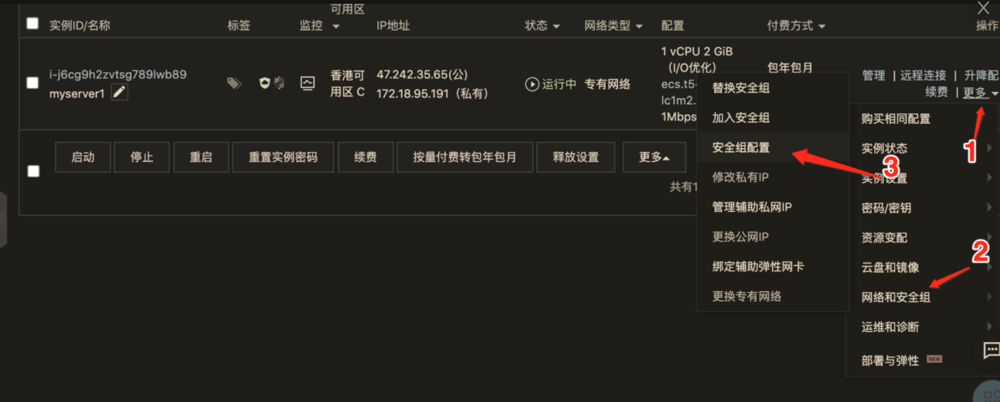

# 反馈问题

- vue ssr 鉴权、路由拦截、cookies传递问题
- vue  ssr 路由拦截     2.vue ssr 鉴权     3.vue ssr cookies传递问题
  - https://www.nuxtjs.cn/examples/auth-routes
  - https://www.nuxtjs.cn/examples/auth-external-jwt
  - https://www.nuxtjs.cn/guide/routing#%E4%B8%AD%E9%97%B4%E4%BB%B6

```js
export default ({ app }) => {
  app.router.beforeEach((to, from, next) => {
    if (process.client) {
    }
  })
}
```

- ssr服务器端渲染跟pwa对比的差异，优缺点
- 希望能扩展讲下 nginx 等服务端工具的使用
- Nuxt.js遇到错误就跳转到Error页面，除了指定自定义的error页面，有没有办法直接阻止这个行为？
- 使用lerna发布过程中  gitHead 字段被添加了，但在发布完后又被删除了，这算正常么？gitHead 是做什么用的呢？
- gridsome的重写规则可以讲下么，如何为动态路由手动重定向？视频中没讲
  - https://gridsome.org/docs/dynamic-routing/#generating-rewrite-rules
- Nuxt属于同构渲染，那我们课程里的real-world这个案例的页面应该是服务端渲染吧，Nuxt是不是只是个使用了Vue语法的服务端的渲染？          
- Nuxt是前后端不分离模式的吗，还是说Nuxt依旧属于前端，只不过将部分渲染工作先在服务端完成了？     
- CI/CD自动化部署到远程服务器上的版本如何进行回退？
- pm2  启动 nuxt ，运行一段时间之后会报错切 无法自动重启。只能手动重启。     2. 关于 nuxt实际性能及生产环境部署方式

# 购买服务器/部署应用

- 47.242.35.65
- nllcoder.com
## 阿里云服务器 - CentOS 8
### 购买服务器

- [https://www.aliyun.com/product/ecs?spm=5176.6660585.h2v3icoap.14.496e6bf8b6KqcF](https://www.aliyun.com/product/ecs?spm=5176.6660585.h2v3icoap.14.496e6bf8b6KqcF)
- 购买香港节点（域名不需要备案）
- 系统选择的是 CentOS 8，或者其它系统

### 远程登录服务器
```bash
ssh root@47.242.36.24

curl https://www.google.com

ssh -D 1080 root@47.242.36.24
```
### SSH 免密登陆

- http://www.ruanyifeng.com/blog/2011/12/ssh_remote_login.html
- 客户端操作
  - **使用 scp 的时候路径中不能有中文 ！**

```bash
# 生成密钥对
cd Users\.ssh
ssh-keygen

# 把公钥拷贝到服务器
scp yupaopao.pub root@47.242.36.24:/root/.ssh
```

- 客户端操作---修改本机的 .ssh/config 文件

```
Host 47.242.36.24
HostName 47.242.36.24
User root
PreferredAuthentications publickey
IdentityFile ~/.ssh/yupaopao
```

- 服务器

```bash
cd ~/.ssh
# 找到 authorized_keys 文件
# 把 nllcoder_com_rsa.pub 文件内容追加到 authorized_keys 文件末尾
cat >> authorized_keys < yupaopao.pub
# 重启 ssh 服务
systemctl restart sshd
```


### 安装 Node.js

- 使用 nvm 安装 Node.js
- [https://github.com/nvm-sh/nvm](https://github.com/nvm-sh/nvm)
```bash
# 查看环境变量
echo $PATH

wget -qO- https://raw.githubusercontent.com/nvm-sh/nvm/v0.35.3/install.sh | bash
# 重新连接 ssh
nvm --version

# 查看环境变量
echo $PATH

# 安装 Node.js lts
nvm install --lts
```

- 安装 pm2
```bash
npm i pm2 -g
```

- pm2 log xx 查看出错日志


## 部署 Nuxt.js 项目
### 手工部署

- baseURL: https://conduit.productionready.io

- .nuxt
- static
- nuxt.config.js
- package.json
- package-lock.json
- pm2.config.json
```bash
# 服务器 root 下创建 realworld 文件夹
mkdir realworld

# 本地运行
scp ./realworld.zip root@47.242.36.24:/home/realworld

cd realworld

# 服务器上解压
unzip release.zip

# 查看隐藏目录
ls -a

# 安装依赖
npm i

# npm run start
pm2 start npm -- start

pm2 start pm2.config.json

pm2 stop all
```

### 服务器开放端口 - 3000、80




### 自动部署

#### Github

- 创建远程仓库
- 个人设置-Developer settings-Personal access tokens
   - 1825e7c694f64701a6d6d93d0f7c25c027c9ade1
- 项目设置-Secrets

## 购买域名/域名解析

- https://homenew.console.aliyun.com/


## 部署 Vue.js 项目
### 在云服务器上安装并配置 Nginx
```bash
# yum是nginx系统中的软件管理工具 利用它下载安装nginx
yum install nginx

# 查找nginx文件
which nginx
# 查寻nginx版本号
nginx -v

# 启动 Nginx
nginx
# 重启
nginx -s reload
# 结束 
nginx -s stop

# 检查nginx下nginx.conf配置文件是否ok
cd /etc/nginx

# 查看配置文件
cat nginx.conf 
nginx.conf内容中`井号`开头的是注释
worker_connections 1024; 表示客户端连接服务端个数限制在1024个

# 备份配置文件
cp /etc/nginx/nginx.conf /etc/nginx/nginx.conf.default

# 修改配置文件
vim /etc/nginx/nginx.conf
# 按esc然后把光标移动到修改的位置即可修改
这里修改server对应的:
# 配置了两个访问的域名地址
  server_name  47.242.36.24 172.24.40.234;  
# Vue项目存放的地方
  root         /home/www; 								 
# 然后按:wq 回车即可保存修改

# 测试配置文件是否有语法错误
nginx -t

# 记得在home下新建www文件
cd /home
mkdir www

# 查看错误日志
cat /var/log/nginx/error.log
```
### 部署 Vue.js 项目 - Node.js

- Vue项目中package.json的name不能是中文,否则启动不了网站

- 查看运行 nginx 进程的账号

```
ps aux | grep nginx
```

- 更改 www 目录的所有者

```
chown nginx:nginx -R .
```

### Github actions 部署

- 安装 git

```bash
yum install git
```

- 在Vue项目根目录`新建.github/workflows/deploy.yml`并写入下面的内容
```bash
name: Publish And Deploy Demo
on:
  # 模拟发布分支 push的时候就去自动部署
  push:
    branches:
      - master

jobs:
  build-and-deploy:
    # 乌班图的系统
    runs-on: ubuntu-latest
    steps:
    # 部署到服务器
    - name: Deploy
      uses: appleboy/ssh-action@master
      #  在git账号中配置secrets并填写一些服务器信息,然后通过它获取
      with:
        host: ${{ secrets.HOST }}
        username: ${{ secrets.USERNAME }}
        key: ${{ secrets.KEY }}
        port: ${{ secrets.PORT }}
        debug: true
        # 运行在服务端的命令
        script: |
        	# tmp临时目录
          cd /tmp
          # 克隆git代码 记得安装git
          git clone https://github.com/CONOR007/vue-automated-deployment.git
          cd /tmp/vue-automated-deployment
          # 运行项目中deploy.sh脚本文件
          chmod +x ./deploy.sh
          ./deploy.sh
```

- 在根目录下新建`deploy.sh`脚本文件,并输入下面的内容
```bash
#!/bin/bash

# 安装依赖
cnpm install

# 打包
npm run build

# 删除 ngnix 指向的文件夹下的文件
rm -rf /home/www/*

# 将打包好的文件复制过去
mv /tmp/vue-automated-deployment/dist/* /home/www

# 删除 clone 的代码
rm -rf /tmp/vue-automated-deployment
```
- 如果 nginx 启动失败，查看错误日志，权限问题，使用下面方式解决

```bash
# 查看错误日志
cat /var/log/nginx/error.log
cd /home/www
# 更改 www 目录的所有者
chown nginx:nginx -R .
```


## Nginx 配置**浏览器缓存**

- **memory cache**

   当直接刷新页面的时候,页面资源会从`内存`中直接获取

- **disk cache**

   如果服务器指定了强缓存它会缓存到`硬盘`上,如果网页关掉再打开浏览器会从磁盘上去加载资源

- **强缓存**,状态码:`200`

   - <- `cache-control`: max-age=600
     - `cache-control`是http1.1中的响应头,max-age=600是缓存600s的意思. 不设置的话默认缓存时间是4天.在这个时间段浏览器不会去服务器获取数据,直接从缓存中获取.
     - 对于JS,CSS等文件可以设置成强缓存
   - <- `expires`: Mon, 14 Sep 2020 09:02:20 GMT
     - `expires`是http1.0中的响应头,他没有max-age属性,功能没有cache-control强大.当cache-control和expires都设置了的时候,只会生效cache-control

- **协商缓存**,访问服务器是否从浏览器缓存中获取,状态码:`304`
  
   - `<-`:表示服务器给浏览器发送的,`->`:表示浏览器给服务器发送的
   - <- `last-modified`: Fri, 07 Aug 2020 02:35:59 GMT
      - 服务器告诉浏览器资源最后的修改时间,
   - -> `if-modified-since`: Fri, 07 Aug 2020 02:35:59 GMT
      - 当浏览器请求数据时会带上浏览器上次请求数据的修改时间,服务器会把这个时间和当前文件最后修改时间作对比,如果修改时间一致说明浏览器之前拿到的是最新文件,则返回304状态码告诉浏览器从缓存中读取.如果浏览器拿到的时间比服务器修改的时间要早那么说明浏览器目前缓存的不是最新文件,则把该文件发送给浏览器并返回200状态码. 但是有的时候文件修改时间变了但是内容没变,这样的话并不准确,所以有了`etag`属性.
   - <- `etag`: W/“5f2cbe0f-2382"
      - 当服务器返回响应的时候会告诉浏览器文件etag的值,etag类似一种hash值,它代表文件内容
   - -> if-none-match: W/"5f2cbe0f-2382"
      - 当浏览器去服务器请求资源的时候,会带上服务器上次返回的etag值.服务器根据这个etag值和当前资源的etag值进行对比.如果一致说明文件没有变动,返回304状态码,如果不一致说明有变动返回200状态码.
   - 默认nginx是开启`etag`和`last-modified`的

### Nginx 配置

- 新建终端下载配置文件

```nginx
scp root@47.242.36.24:/etc/nginx/nginx.conf ./
```

- 在http中添加gizp相关配置,加快传输速度
```yaml
http {
  # 开启gzip
  gzip on;
  # 启用gzip压缩的最小文件；小于设置值的文件将不会被压缩
  gzip_min_length 1k;
  # gzip 压缩级别 1-10 
  gzip_comp_level 2;
  # 进行压缩的文件类型。
  gzip_types text/plain application/javascript application/x-javascript text/css application/xml text/javascript application/x-httpd-php image/jpeg image/gif image/png;
  # 是否在http header中添加Vary: Accept-Encoding，建议开启
  gzip_vary on;
  # etag协商缓存 默认是开启的
  etag on;
}
```

- 在server中添加协商缓存和强缓存配置,解决缓存问题
```bash
server {
	# html设置成协商缓存或者不缓存
	location ~* \.(html)$ {
		# 关闭访问日志
    access_log off;
    # 添加响应头,no-cache:协商缓存,no-store:不缓存
    add_header  Cache-Control  max-age=no-cache;
  }
	
	# 特定文件设置强缓存
  location ~* \.(css|js|png|jpg|jpeg|gif|gz|svg|mp4|ogg|ogv|webm|htc|xml|woff)$ {
    access_log off;
    add_header    Cache-Control  max-age=360000; # 4天
  }
}
```
- 上传修改好的nginx.conf到服务器

```nginx
 scp nginx.conf root@47.242.36.24:/etc/nginx/nginx.conf
```

- 到服务器重启nginx服务器即可

```nginx
nginx -s reload
```

## 反向代理配置


```
location /api/ {
  add_header Access-Control-Allow-Credentials true;
  add_header Access-Control-Allow-Origin $http_origin;
  add_header Access-Control-Allow-Methods 'GET, POST, PUT, PATCH, DELETE, OPTIONS';
  add_header Access-Control-Allow-Headers 'Authorization, Content-Type, Accept, Origin, User-Agent, DNT, Cache-Control, X-Mx-ReqToken, X-Requested-With';
  add_header Access-Control-Max-Age 86400;
  proxy_pass http://realworld.api.fed.lagounews.com/api/;
}
```

## HTTPS 配置

- [点击获取ssl免费证书](https://console.cloud.tencent.com/ssl/apply)

- [购买域名&&域名解析](https://homenew.console.aliyun.com/)

- 获取到证书之后打包Nginx证书文件夹并上传证书到服务器/etc/pki下

  ```bash
  scp nginx.zip root@yupaopao.icu:/etc/pki
  ```

- 服务端输入命令查看

  ```bash
  cd /etc/pki
  unzip nginx.zip
  rm -rf nginx.zip 
  cd Nginx/
  ```

- **HTTPS 域名还需要配置**
- 安全组规则里打开 443 端口并做好缓存配置
```bash
   server {
       listen       443 ssl http2 default_server;
       listen       [::]:443 ssl http2 default_server;
       server_name  www.yupaopao.icu yupaopao.icu;
       root         /home/www;

       ssl_certificate "/etc/pki/nginx/1_yupaopao.icu_bundle.crt";
       ssl_certificate_key "/etc/pki/nginx/2_yupaopao.icu.key";
       ssl_session_cache shared:SSL:1m;
       ssl_session_timeout  10m;
       ssl_ciphers PROFILE=SYSTEM;
       ssl_prefer_server_ciphers on;

       # Load configuration files for the default server block.
       include /etc/nginx/default.d/*.conf;

        location ~* \.(html)$ {
            # 关闭访问日志
            access_log off;
            # 添加响应头,no-cache:协商缓存,no-store:不缓存
            add_header  Cache-Control  max-age=no-cache;
        }
            
            # 特定文件设置强缓存
        location ~* \.(css|js|png|jpg|jpeg|gif|gz|svg|mp4|ogg|ogv|webm|htc|xml|woff)$ {
            access_log off;
            add_header    Cache-Control  max-age=360000;
        }

       location / {
       }

       error_page 404 /404.html;
           location = /40x.html {
       }

       error_page 500 502 503 504 /50x.html;
           location = /50x.html {
       }
   }
```
```bash
location /api/ {
	proxy_pass http://realworld.api.fed.lagounews.com/api/;
}

location / {
	proxy_pass http://127.0.0.1:3000;
}
```
- 访问http时重定向到https,在http server中配置

```bash
# 永久重定向到https
return 301 https://www.yupaopao.icu$request_uri;
```

- 配置好之后上传

```bash
scp nginx.conf root@yupaopao.icu:/etc/nginx/nginx.conf
```

- 重启即可生效

```nginx
nginx -s reload
```

### 开启HTTP/2 的好处

1. 压缩请求头与响应头,发送一串数字标识到服务器,服务器根据这个数字标识去查表.从而大大减小发送请求头与响应头的数据量

2. 支持serve push,在浏览器请求首页的时候直接把首页中需要返回的资源一并返回.减少请求耗费的时间可在nginx.conf中作如下配置.

   ```nginx
   location / {
     http2_push /css/app.3d328b21.css;
     http2_push /js/app.03455d91.js;
     http2_push /js/chunk-vendors.b2150c02.js;
   }
   ```

3. 详情可参考[栾一峰老师网络日志](http://www.ruanyifeng.com/blog/2018/03/http2_server_push.html)


### Nginx使用命令

- 查看端口

```nginx
# 查看所有端口
netstat -tunlp 
# 查看已知的端口是否被占用
netstat -tunlp |grep 9090
# 删除已被占用的端口
kill -9 pid
```

- 从svn上拉项目

```nginx
# path是服务器上的目录
svn checkout path
# 简写
svn co
```


